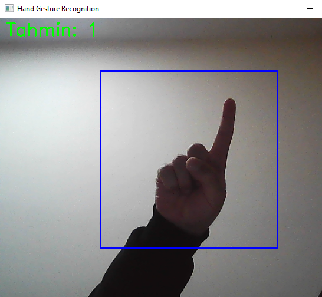
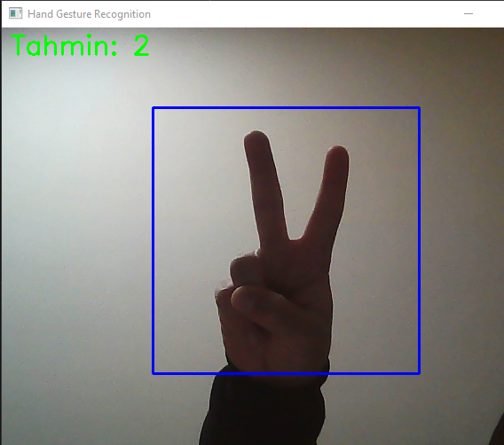
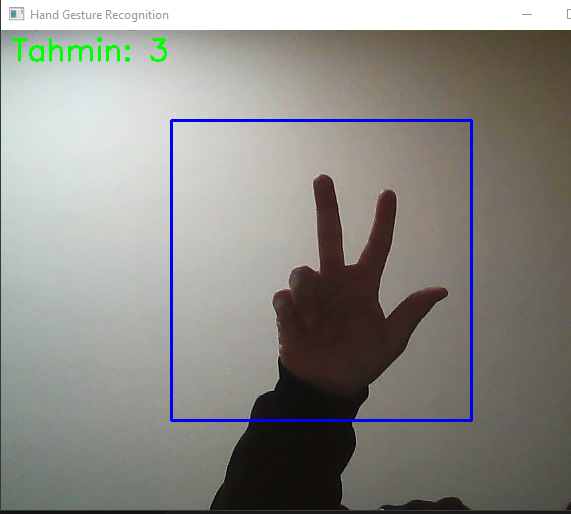
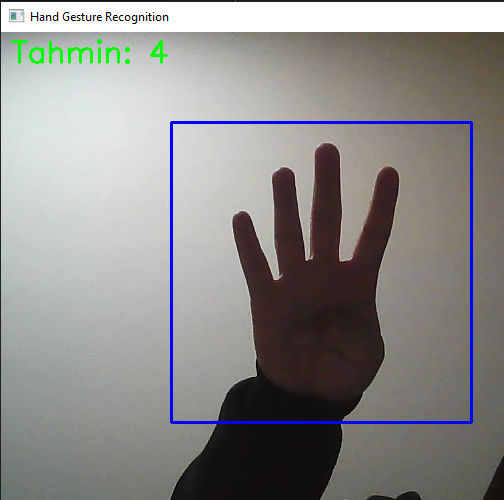
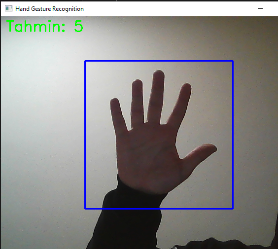

# 🖐️ Hand Gesture Number Recognition AI

This project is a real-time hand gesture recognition system developed using Python, OpenCV, and TensorFlow/Keras. It detects hand gestures via a webcam and predicts numbers using a custom Convolutional Neural Network (CNN).

## 🚀 Features
- **Real-Time Detection:** Captures and processes live video feed using OpenCV.
- **CNN Architecture:** Trained with a custom Deep Learning model using Conv2D and MaxPooling layers.
- **Data Augmentation:** Implemented `ImageDataGenerator` (rescaling, zooming, shearing) to prevent overfitting and improve model generalization.
- **ROI (Region of Interest)::** Focuses processing on a specific area (blue rectangle) to enhance accuracy and performance.

## 📷 Screenshots (Demo)

| Prediction: 1 | Prediction: 2 | Prediction: 3 |
| :---: | :---: | :---: |
|  |  |  |

| Prediction: 4 | Prediction: 5 |
| :---: | :---: |
|  |  |

## 🛠️ Tech Stack
- **Language:** Python 3.x
- **Libraries:** TensorFlow, Keras, OpenCV, NumPy

## ▶️ Installation & Usage
1. Install the required dependencies:
   ```bash
   pip install tensorflow opencv-python numpy
2. Train the model (Optional - requires dataset):
   python train_model.py
3. Run the prediction system:
   python predict.py
   
